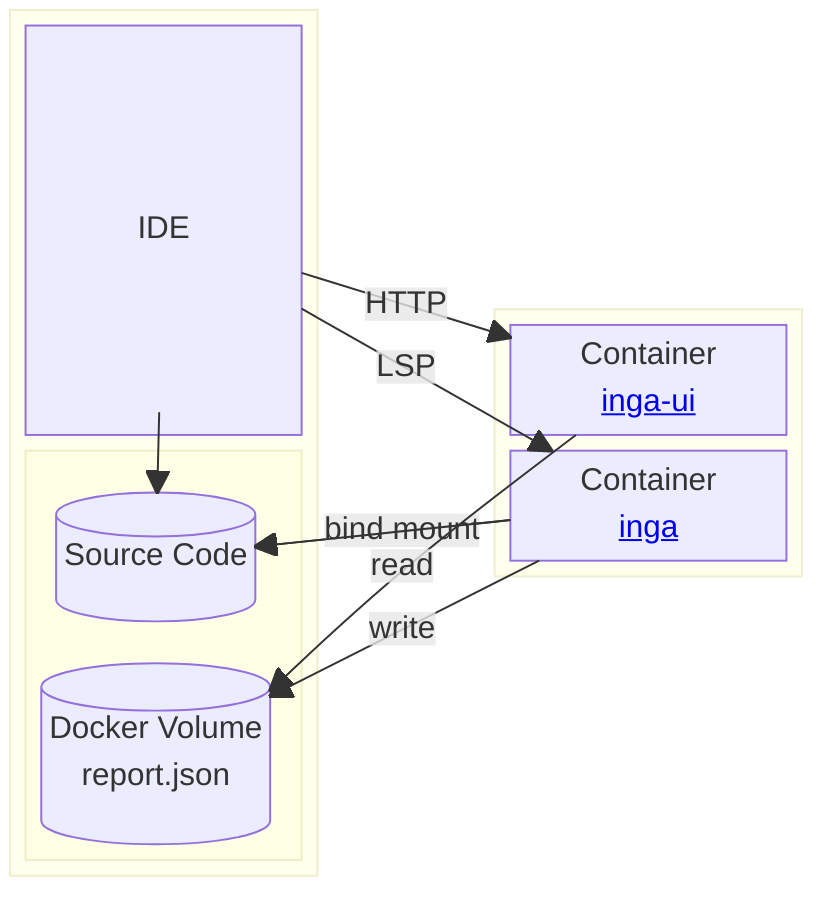

# Architecture

```mermaid
block-beta
columns 5
  block:Host:2
    columns 1
    IDE
    block
      columns 1
      Source[("Source Code")]
      DockerVolume[("Docker Volume\nreport.json")]
    end
  end
  space
  block:Container:2
    columns 1
    inga_ui["Container\n<a href='https://github.com/seachicken/inga-ui'>inga-ui</a>"]
    inga["Container\n<a href='https://github.com/seachicken/inga'>inga</a>"]
  end

  IDE --> Source
  IDE -- "HTTP" --> inga_ui
  IDE -- "LSP" --> inga
  inga -- "bind mount" --> Source
  inga_ui -- "read" --> DockerVolume
  inga -- "write" --> DockerVolume
  inga --> Source
```
