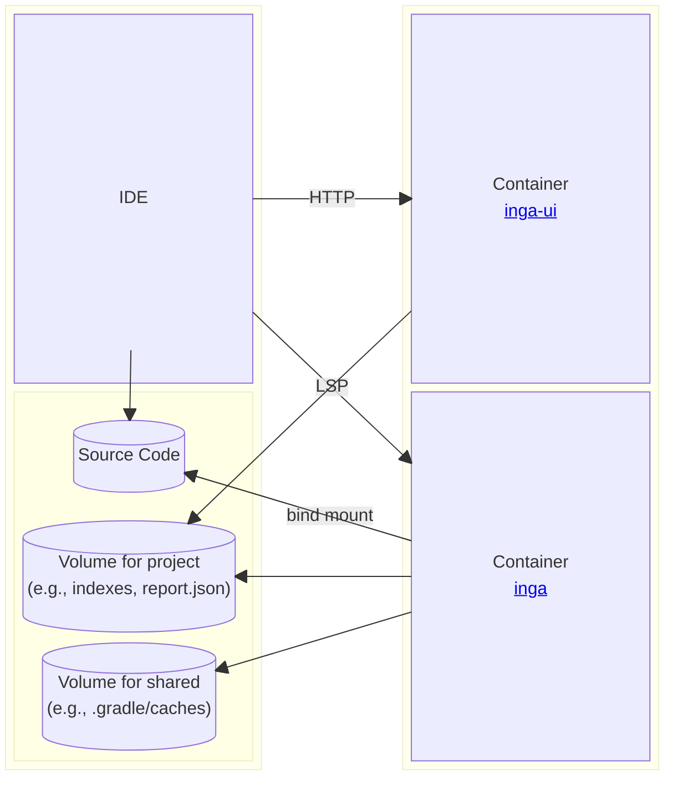

# Architecture

- Analyze your code only on your local machine (The plugin will download Docker images and dependencies for analysis. Other than that, you should not see any other outbound traffic.)

